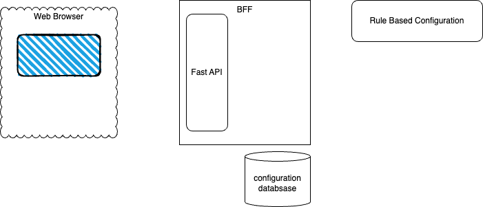

# SaaS Configurator

A Kafka cluster configurator for a SaaS ISV demonstration.

## Project Description

The SaaS Configurator is a full-stack web application that provides an intelligent configuration management system for cluster deployments. It combines a FastAPI backend with a React frontend to offer a rule-based configuration system that helps users define, manage, and validate Kafka cluster configurations.

## Architecture

1. **Backend for Front End (FastAPI)**
   - Built with FastAPI for high-performance API endpoints
   - Uses Pydantic for robust data validation
   - Implements a rule-based configuration engine
   - Provides RESTful CRUD operations for configurations
   - Currently uses in-memory storage (can be extended to persistent storage)

2. **Frontend (React + TypeScript)**
   - Modern React application with TypeScript
   - Component-based architecture
   - Real-time validation and feedback
   - Responsive design for all devices
   - Clean separation of concerns

3. **Configuration Engine**
   - Rule-based system for cluster configuration
   - Supports multiple cluster types:
     - Basic Cluster
     - Dedicated Cluster
     - Enterprise Cluster
     - Freight Cluster
     - Kafka Cluster
     - Standard Cluster
   - Inference capabilities for cluster type determination
   - Multi-language support (en, fr) for data types

## Development

### 